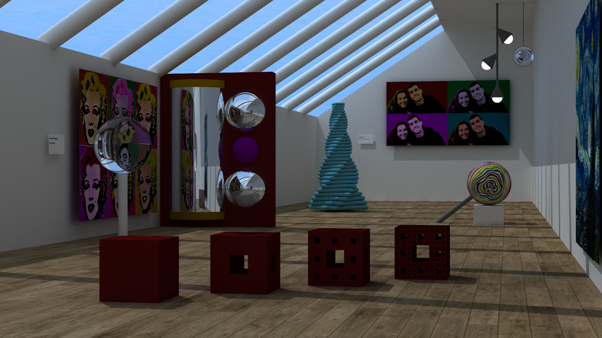

# ComputerGraphics
Assignments for Computer Graphics course 2018/19. It includes a Path Tracer developed from scratch, and a Photon Mapping based on given code.

The following image was created using the developed Path Tracer, just using the C++ STD Library:

